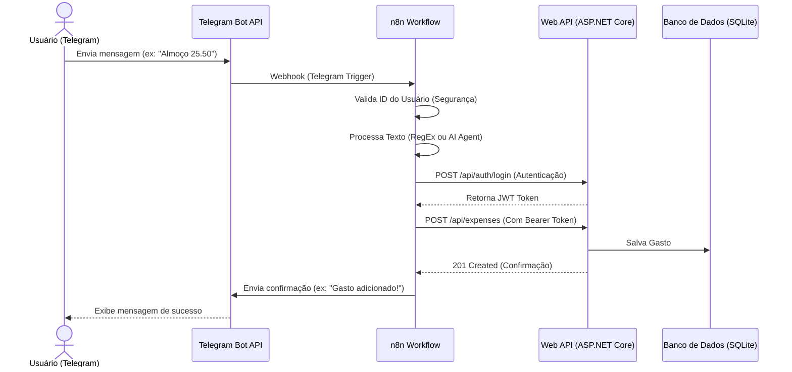

# Integração Telegram Bot + n8n + Web API (Conekta Finance)

Este guia descreve como implementar uma funcionalidade onde você (ou outros usuários) podem enviar mensagens de texto para um Bot no Telegram (ex: *"Almoço 25.50 Alimentação"* ou *"Hoje gastei 80 reais com combustível"*) e o sistema adicionará a despesa automaticamente.

---

## 1. Visão Geral da Arquitetura

O fluxo de dados segue a seguinte sequência:



---

## 2. Pré-requisitos

1. **Instância do n8n**: Pode ser local (rodando via Docker no mesmo servidor ou máquina local) ou n8n Cloud.
2. **Bot no Telegram**: Criado através do `@BotFather` no Telegram.
3. **Acesso à API**: O n8n precisa conseguir se comunicar com a Web API. 
   - Se estiver rodando localmente no Docker, pode usar o nome do serviço `backend:8080` na mesma rede docker ou `http://localhost:5041` (ou a porta exposta pelo seu Nginx, `http://localhost:8888`).
   - Se o n8n estiver na nuvem (Cloud), a API do seu sistema precisa estar publicada e acessível publicamente (com HTTPS).

---

## 3. Passo a Passo da Implementação

### Passo 1: Criar o Bot no Telegram
1. Abra o Telegram e procure por `@BotFather`.
2. Envie o comando `/newbot`.
3. Siga as instruções para dar um nome e um username ao bot.
4. Salve o **HTTP API Token** gerado (ex: `123456789:ABCdefGhIJKlmNoPQRsTUVwxyZ`).
5. Inicie uma conversa com seu bot recém-criado e envie qualquer mensagem (ex: `/start`).

---

### Passo 2: Configurar o Workflow no n8n

Você criará um workflow contendo os seguintes nós (nodes):

#### A. Telegram Trigger (Gatilho)
Este nó iniciará o fluxo sempre que uma nova mensagem for enviada ao bot.
- **Connection**: Adicione uma nova credencial usando o token do `@BotFather`.
- **Updates**: Selecione `message`.

#### B. Filter / If (Segurança)
Para evitar que qualquer pessoa na internet adicione despesas no seu sistema ao descobrir o bot:
- Adicione um nó **If**.
- Condição: `{{ $json.message.from.id }} (Number)` é igual a `SEU_TELEGRAM_USER_ID`.
- *Como descobrir seu ID:* Você pode obter enviando uma mensagem para o bot `@userinfobot` no Telegram, ou verificando a saída do nó *Telegram Trigger* no n8n na primeira execução.

#### C. Parsing da Mensagem (Extração dos Dados)
Aqui definimos como converter a mensagem de texto em dados estruturados (Valor, Descrição, Categoria). Existem duas abordagens:

##### Opção A: Padrão Estruturado (Sem custos de API)
O usuário deve enviar a mensagem em um padrão fixo, como:
`[VALOR] [DESCRIÇÃO] [CATEGORIA]`
Exemplo: `35.90 Almoço na Padaria Alimentação`

Adicione um nó **Code (JavaScript)** no n8n com o seguinte código para fazer o split e parsing:

```javascript
const text = $input.item.json.message.text;

// Regex simples para capturar:
// 1. O valor (numérico, aceitando ponto ou vírgula)
// 2. A descrição (qualquer texto no meio)
// 3. A categoria (última palavra da mensagem)
const regex = /^([\d+[\.,]?\d*]+)\s+(.+)\s+(\w+)$/;
const match = text.match(regex);

if (!match) {
  throw new Error("Formato inválido! Envie no formato: 'VALOR DESCRIÇÃO CATEGORIA'. Ex: '25.50 Uber Trabalho'");
}

const value = parseFloat(match[1].replace(',', '.'));
const description = match[2];
const categoryName = match[3];

return {
  json: {
    value,
    description,
    categoryName
  }
};
```

##### Opção B: Linguagem Natural com IA (Recomendado - Mais Inteligente e Direto)
Se você utilizar o nó **AI Agent** no n8n associado a um LLM (como OpenAI GPT-4o, Anthropic Claude ou Google Gemini), você pode instruir a IA a processar a linguagem natural e **já formatar a saída exatamente na estrutura do payload de integração da API**. 

Dessa forma, você **não precisa de nenhum nó de JavaScript adicional** para mapear categorias ou formatar dados! O fluxo no n8n se torna apenas:
`Telegram Trigger ➔ If (Segurança) ➔ AI Agent ➔ HTTP Request ➔ Telegram Reply`

Configure o nó **AI Agent** com o seguinte **System Prompt**:
> *"Você é um assistente financeiro pessoal de inteligência artificial. Sua tarefa é ler a mensagem enviada pelo usuário no Telegram sobre uma despesa e transformá-la em um objeto JSON estruturado contendo as propriedades abaixo.
> 
> Mapeamento de Categoria (use obrigatoriamente um destes IDs em 'categoryId'):
> - 1: Alimentação (comida, restaurante, ifood, mercado, supermercado, etc.)
> - 2: Transporte (uber, combustível, metrô, ônibus, táxi, gasolina, etc.)
> - 3: Lazer (cinema, shows, jogos, viagens, festas, bares, etc.)
> - 4: Saúde (farmácia, consultas, remédios, dentista, plano de saúde, etc.)
> - 5: Educação (mensalidades, cursos, livros, material escolar, etc.)
> - 6: Moradia (aluguel, condomínio, luz, água, internet, reparos, etc.)
> - 7: Outros (qualquer despesa que não se encaixe nas categorias acima)
> 
> Estrutura JSON de saída esperada (retorne apenas o JSON, sem formatação markdown):
> {
>   "userEmail": "usuario@teste.com",
>   "categoryId": <int>,
>   "description": "<string com a descrição limpa do gasto, ex: 'Almoço no shopping' ou 'Combustível'>",
>   "value": <number com o valor decimal do gasto>,
>   "transactionDate": "<string contendo a data do gasto no formato ISO 8601 (YYYY-MM-DDTHH:mm:ss.sssZ). Se não mencionada na mensagem, use a data/hora atual do sistema>",
>   "observation": "Enviado via Telegram Bot",
>   "isRecurrent": false
> }"

- **Entrada (Input)**: `{{ $json.message.text }}`
- **Dica de configuração no n8n**: Você pode acoplar um nó de **Structured Output Parser** no AI Agent para forçar a saída a seguir exatamente esse esquema JSON.

---

#### D. Obter Categoria (Dynamic Mapping)
A API do sistema precisa receber o `CategoryId` (um número de 1 a 7) e não o nome da categoria por extenso. 

Você pode mapear os nomes no n8n usando um nó **Code (JavaScript)** ou fazendo uma requisição `GET /api/categories` e filtrando. Segue uma tabela estática com base nas categorias cadastradas em `AppDbContext.cs`:

| ID | Categoria |
| :--- | :--- |
| **1** | Alimentação |
| **2** | Transporte |
| **3** | Lazer |
| **4** | Saúde |
| **5** | Educação |
| **6** | Moradia |
| **7** | Outros |

Código JavaScript no n8n para mapear:

```javascript
const categoryMap = {
  'alimentacao': 1, 'alimentação': 1, 'comida': 1, 'supermercado': 1, 'ifood': 1, 'restaurante': 1,
  'transporte': 2, 'uber': 2, 'combustivel': 2, 'combustível': 2, 'metro': 2, 'metrô': 2, 'taxi': 2,
  'lazer': 3, 'cinema': 3, 'jogo': 3, 'viagem': 3, 'show': 3,
  'saude': 4, 'saúde': 4, 'farmacia': 4, 'farmácia': 4, 'dentista': 4, 'medico': 4,
  'educacao': 5, 'educação': 5, 'curso': 5, 'livro': 5, 'escola': 5,
  'moradia': 6, 'aluguel': 6, 'luz': 6, 'agua': 6, 'água': 6, 'internet': 6,
  'outros': 7, 'diverso': 7, 'diversos': 7
};

const inputCategory = ($input.item.json.categoryName || 'outros').toLowerCase().trim();
const categoryId = categoryMap[inputCategory] || 7; // Padrão "Outros" se não encontrar

return {
  json: {
    ...$input.item.json,
    categoryId
  }
};
```

---

### Passo 3: Comunicação e Autenticação com a API

Você pode escolher entre duas formas para o n8n se comunicar com a Web API.

#### Método 1 (Recomendado): Conexão Direta via API Key (Sem Login JWT)
Este método utiliza o endpoint `/api/integration/expense`, que não requer autenticação JWT por login dinâmico, facilitando e otimizando o fluxo no n8n.

> [!TIP]
> Como seu **n8n** roda em outra máquina no seu homelab (`192.168.18.100`) e a sua API roda no seu computador local (`192.168.18.4`), **você não deve usar `localhost` na URL do n8n**. Substitua `localhost` pelo IP do seu PC. Exemplo: `http://192.168.18.4:5041/api/integration/expense`.
>
> O backend já está configurado em `launchSettings.json` para escutar em `0.0.0.0`, permitindo conexões externas da rede local.

Use um único nó **HTTP Request** no n8n:
- **Method**: `POST`
- **URL**: `http://192.168.18.4:5041/api/integration/expense`
- **Headers**:
  - `X-API-KEY`: `conekta-finance-n8n-integration-secret-key-2026` (Chave configurada em seu `appsettings.json`)
- **Send Body**: `true`
- **Body Content Type**: `JSON`
- **Inputs** (Se a IA retornou o JSON completo na propriedade `output` como string):
  Você pode simplesmente usar a seguinte expressão no campo de Body do nó HTTP Request:
  ```json
  {{ JSON.parse($json.output) }}
  ```
  *(Nota: Isso converterá a string da IA direto para o objeto JSON plano esperado pela API, já contendo o `userEmail` e todos os campos).*

  *Alternativa opcional:* Você pode inserir um nó **Code** (JavaScript) entre o **AI Agent** e o **HTTP Request** com o código abaixo para limpar a saída antes de enviar à API:
  ```javascript
  const parsed = JSON.parse($input.item.json.output);
  return {
    json: {
      userEmail: "usuario@teste.com",
      ...parsed
    }
  };
  ```
  Neste caso, o **HTTP Request** envia apenas o body com a expressão `{{ $json }}`.

*Vantagens:* Não requer login, é mais rápido e permite mapear a despesa para qualquer usuário bastando alterar o campo `userEmail` no JSON.

---

#### Método 2: Autenticação Tradicional JWT (Com Login Dinâmico)
Caso prefira usar as rotas padrões protegidas por token JWT da aplicação, o n8n precisará de 2 nós para realizar a inserção:

##### A. Requisição HTTP - Autenticação (Login)
Obtém o token JWT a partir de um usuário/senha.
- **Method**: `POST`
- **URL**: `http://localhost:5041/api/Auth/login`
- **Send Body**: `true`
- **Body Content Type**: `JSON`
- **Inputs**:
  ```json
  {
    "email": "usuario@teste.com", 
    "password": "senha123"
  }
  ```
- **Output**: Salva o token JWT de retorno (`token`).

##### B. Requisição HTTP - Cadastrar Despesa (Com JWT)
- **Method**: `POST`
- **URL**: `http://localhost:5041/api/expenses`
- **Headers**:
  - `Authorization`: `Bearer {{ $json.token }}`
- **Send Body**: `true`
- **Body Content Type**: `JSON`
- **Inputs**:
  ```json
  {
    "categoryId": {{ $('NOME_DO_NO_DE_PARSING').item.json.categoryId }},
    "description": "{{ $('NOME_DO_NO_DE_PARSING').item.json.description }}",
    "value": {{ $('NOME_DO_NO_DE_PARSING').item.json.value }},
    "transactionDate": "{{ new Date().toISOString() }}",
    "observation": "Enviado via Telegram Bot",
    "isRecurrent": false
  }
  ```

---

#### G. Telegram - Enviar Resposta
Após a API retornar sucesso (status 201), envie uma confirmação para o usuário.
- **Node**: **Telegram** (Action: *Send Message*)
- **Chat ID**: `{{ $('Telegram Trigger').item.json.message.chat.id }}`
- **Text**: 
  > 💸 *Gasto registrado com sucesso!*
  > 📝 *Descrição:* `{{ $('NOME_DO_NO_DE_PARSING').item.json.description }}`
  > 💰 *Valor:* `R$ {{ $('NOME_DO_NO_DE_PARSING').item.json.value.toFixed(2) }}`
  > 🏷️ *Categoria:* `{{ $('NOME_DO_NO_DE_PARSING').item.json.categoryName }}`

---

## 4. Otimização e Melhorias Futuras (Multi-usuários)

Se você planeja expandir isso para que múltiplos usuários do sistema possam usar o Telegram, a melhor estratégia é **linkar a conta do Telegram ao usuário no Banco de Dados**.

### Como Fazer:
1. **Modificar a Entidade User**:
   Adicionar uma propriedade `TelegramChatId` (tipo `string` ou `long?`) no modelo [User.cs](file:///c:/Users/Fred/ADS/PIM-III/backend/Domain/Entities/User.cs):
   ```csharp
   public string? TelegramChatId { get; set; }
   ```
2. **Criar um Endpoint de Vinculação**:
   Criar um endpoint `POST /api/auth/link-telegram` onde o usuário logado envia um código temporário de verificação enviado pelo bot.
3. **No n8n**:
   - Quando receber uma mensagem, o n8n consulta a API: `GET /api/users/by-telegram/{{ chat.id }}`.
   - O backend verifica qual usuário possui aquele `TelegramChatId` e retorna o ID do usuário (ou você cria um endpoint específico de criação de gasto por Telegram que resolve o usuário de forma interna, sem expor as senhas).
